# Framework Yuri Pêpe

## Padrão de Projeto: Factory Method

### Intenção

Define uma interface para criar um objeto, mas permite que as subclasses decidam qual classe concreta instanciar. No contexto do framework, o Factory Method gerencia o processo de construção de diferentes tipos de jogos de tabuleiro.

### Estrutura
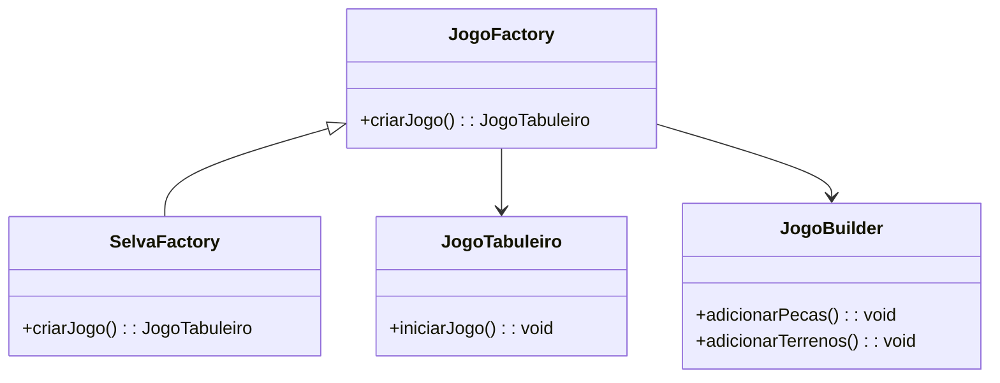

### Participantes no Framework

- **Produto (JogoTabuleiro):** A classe `JogoTabuleiro` representa o jogo de tabuleiro criado.
- **Criador (JogoFactory):** A classe abstrata `JogoFactory` define o método `criarJogo()`, que utiliza o `JogoBuilder` para construir o jogo.
- **Criadores Concretos (SelvaFactory):** Classes que estendem `JogoFactory` e implementam o método `criarBuilder()` para retornar o Builder concreto adequado.

### Código do Framework
@import "src/framework/JogoFactory.java";
@import "src/framework/JogoBuilder.java";
@import "src/jogo/jogoselva/SelvaFactory.java";

## Padrão de Projeto: Builder

### Intenção

Separa a construção de um objeto complexo da sua representação para que o mesmo processo de construção possa criar diferentes representações.
### Estrutura
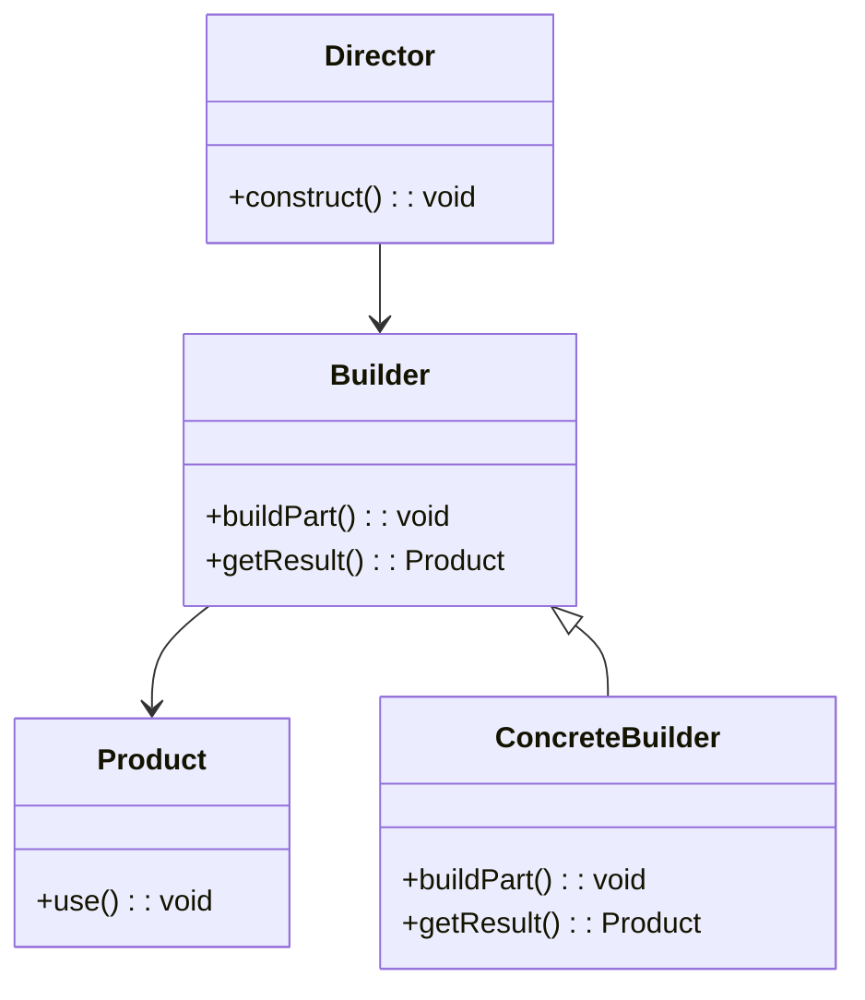
### Participantes no Framework

- **Construtor (JogoBuilder):** Define os passos para construir o `JogoTabuleiro`.
- **Diretor (JogoDirector):** Controla a construção de um jogo usando um `JogoBuilder`.
- **Produto (JogoTabuleiro):** O resultado final da construção.

### Código do Framework
@import "src/framework/JogoBuilder.java";
@import "src/framework/JogoDirector.java";
@import "src/jogo/jogoselva/JogoSelvaBuilder.java";

## Padrão de Projeto: Prototype

### Intenção

Permite criar novos objetos ao clonar uma instância existente, utilizando a interface Cloneable no Java para evitar a criação do objeto do zero.

### Estrutura
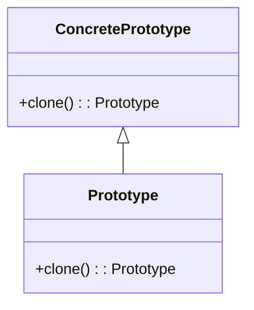

### Participantes no Framework
-  **Prototype (InterfacePeca):** Clonável com o método `clone()`
- **ConcretePrototype (Peca):** Clonável com o método `clone()`.

### Código do Framework
@import "src/framework/InterfacePeca.java";
@import "src/framework/Peca.java";

## Padrão de Projeto: Multiton

### Intenção

Utiliza um enum para garantir um número fixo de instâncias, representando os jogadores no jogo. Cada jogador é representado por uma única instância e compartilhado conforme necessário.

### Estrutura
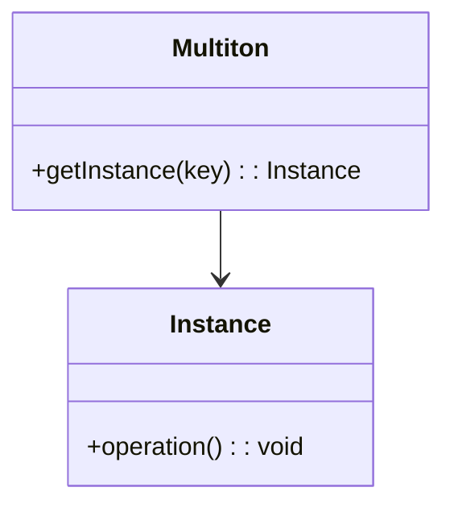

## Participantes no Framework

- **enum (Jogador):** Usado para garantir uma instância por jogador.

### Código do Framework
@import "src/framework/Jogador.java";

## Padrão de Projeto: Flyweight
### Estrutura
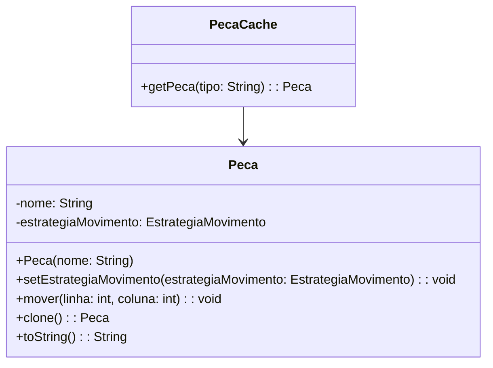

### Intenção

Reduz o custo de criação de objetos ao compartilhar objetos semelhantes em vez de criar novos.

### Participantes no Framework

- **Flyweight (PecaCache):** Gerencia um conjunto de objetos `Peca` compartilhados.

### Código do Framework
@import "src/framework/PecaCache.java";

## Padrão de Projeto: Decorator
Anexa responsabilidades adicionais a um objeto dinamicamente. No caso do framework, o Decorator é utilizado para adicionar diferentes tipos de terrenos ao tabuleiro.

### Estrutura
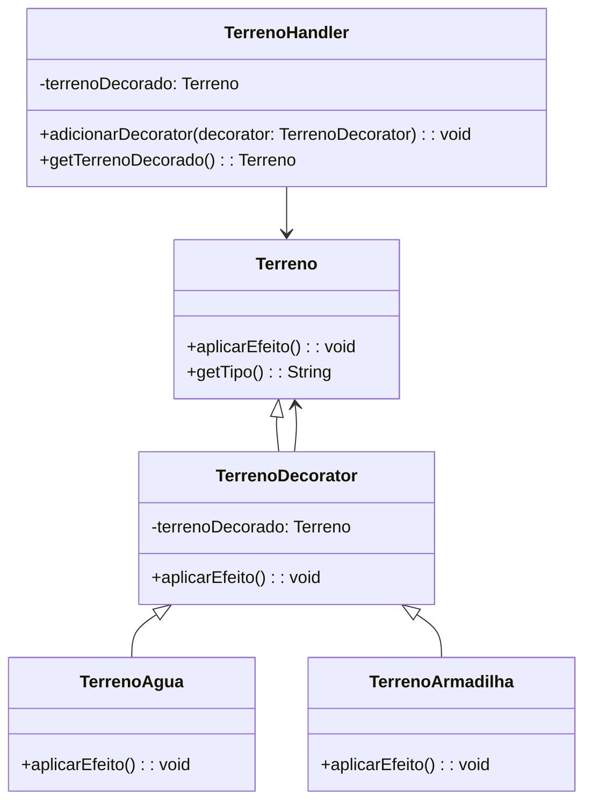

### Descrição da Estrutura

- **Component (Terreno):** Classe base que define a operação `aplicarEfeito()` e um método para obter o tipo de terreno.
- **Decorator (TerrenoDecorator):** Classe abstrata que contém uma referência ao objeto `Terreno` que está decorando. Ela implementa o método `aplicarEfeito()` que chama o método do terreno decorado.
- **Decoradores Concretos (TerrenoAgua, TerrenoArmadilha):** Implementações concretas de `TerrenoDecorator` que adicionam efeitos específicos ao aplicar o efeito do terreno.
- **Handler (TerrenoHandler):** Classe responsável por manter a referência do terreno mais externo decorado. Ela encapsula a lógica de decoração e garante que você sempre trabalhe com a versão mais decorada do terreno, permitindo adicionar novas camadas de decoração.

### Código do Framework
@import "src/framework/Terreno.java";
@import "src/framework/TerrenoDecorator.java";
@import "src/jogo/jogoselva/TerrenoAgua.java";
@import "src/jogo/jogoselva/TerrenoArmadilha.java";
@import "src/jogo/jogoselva/JogoSelvaBuilder.java";

## Padrão de Projeto: Proxy

### Intenção

Uilizada para verificar se as jogadas serao possiveis.
### Estrutura
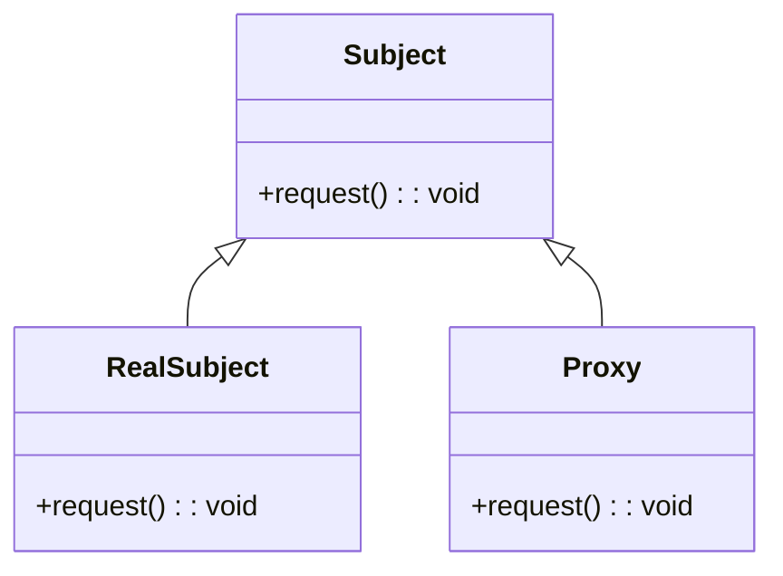

### Participantes no Framework
- **Subject (InterfacePeça):** Define a interface comum para as operações que podem ser realizadas.
- **RealSubject (Peça):** Define a interface comum para as operações que podem ser realizadas.
- **Proxy (PecaProxy):** Controla o acesso ao objeto real e implementa as operações da interface Peça.

### Código do Framework
@import "src/framework/Peca.java";
@import "src/framework/PecaProxy.java";

# Padrão de Projeto: Facade

## Intenção

Fornece uma interface simplificada para um conjunto de interfaces em um subsistema. Facilita o uso e a interação com o sistema ao reduzir a complexidade para o cliente.
### Estrutura
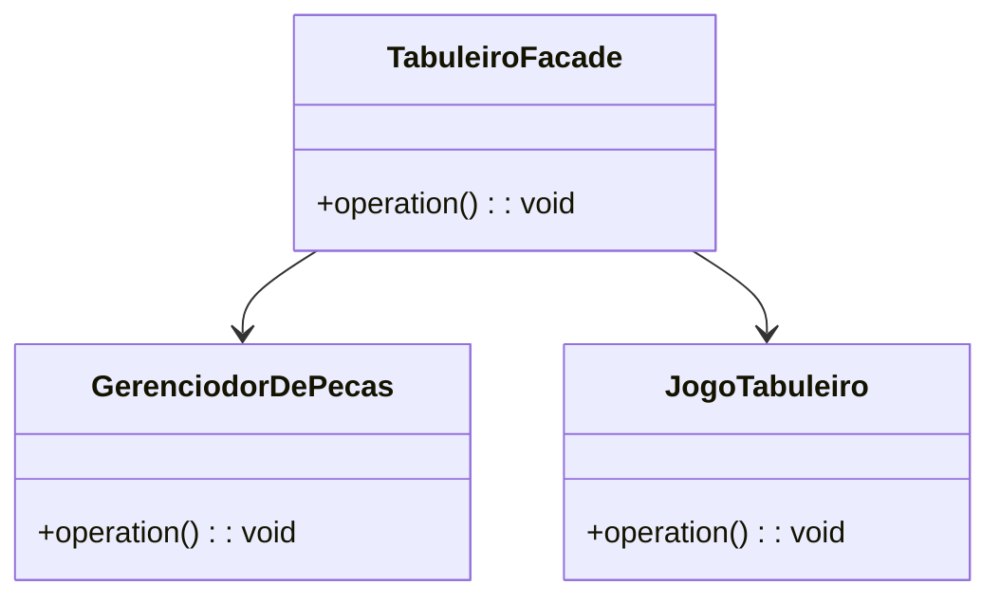

### Participantes no Framework
- **Facade (TabuleiroFacade):** Simplifica a interação com o sistema de gerenciamento do JogoTabuleiro, permitindo que o usuário execute operações complexas de forma simples.
- **Subsistemas (GerenciodorDePecas,JogoTabuleiro ):** Classes que representam a lógica de jogo e as peças, utilizadas pela Facade.

## Código do Framework
@import "src/framework/TabuleiroFacade.java";
@import "src/framework/GerenciadorDePecas.java";

# 3 parte
# Padrão de Projeto: Strategy

## Intenção
Define uma família de algoritmos, encapsula cada um deles e os torna intercambiáveis. O padrão permite que o algoritmo varie independentemente dos clientes que o utilizam, utilizado no framework para logica de movimentaçao da peca.

### Estrutura
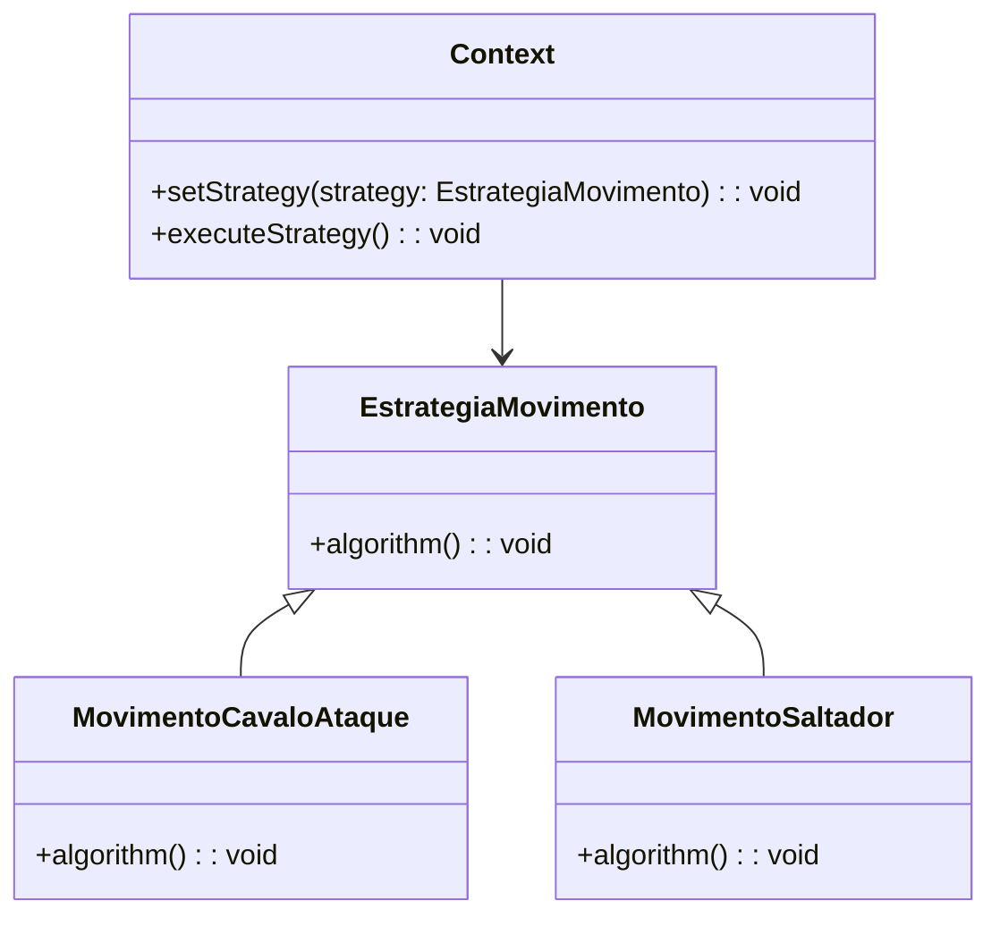

## Participantes no Framework
- **Contexto (Peca):** A peça do tabuleiro que utiliza uma estratégia específica para movimentação ou habilidade.
- **Strategy (EstrategiaMovimento):** Define a interface comum para todas as estratégias de movimentação ou habilidade.
- **ConcreteStrategy (MovimentoCavaloAtaque, MovimentoSaltador):** Implementa as estratégias específicas, como movimentação padrão e especial das peças.

## Código do Framework
@import "src/framework/EstrategiaMovimento.java";
@import "src/framework/Peca.java";
@import "src/jogo/jogocamelot/MovimentoCavaloAtaque.java";
@import "src/jogo/jogocamelot/MovimentoSaltador.java";

# Padrão de Projeto: Memento

## Intenção
Permite capturar e armazenar o estado interno de um objeto sem expor sua implementação, permitindo que o objeto possa ser restaurado a um estado anterior posteriormente.

## Estrutura

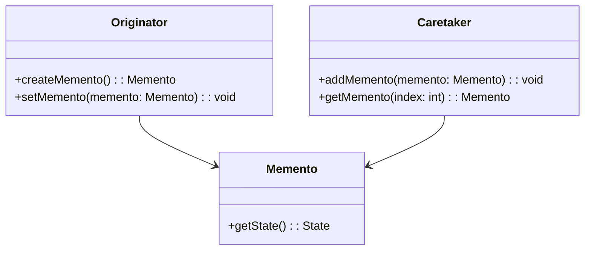
## Participantes no Framework
- **Originator (JogoTabuleiro):** Cria e restaura seu estado a partir do objeto Memento.
- **Memento (TabuleiroMemento):** Armazena o estado do jogo, que pode ser restaurado.
- **Caretaker (TabuleiroCaretaker):** Armazena os objetos Memento, permitindo que o estado do jogo seja salvo e recuperado.
## Código do Framework
@import "src/framework/JogoTabuleiro.java";
@import "src/framework/TabuleiroMemento.java";
@import "src/framework/TabuleiroCaretaker.java";

# Padrão de Projeto: Command
Função: mover peças 
## Estrutura

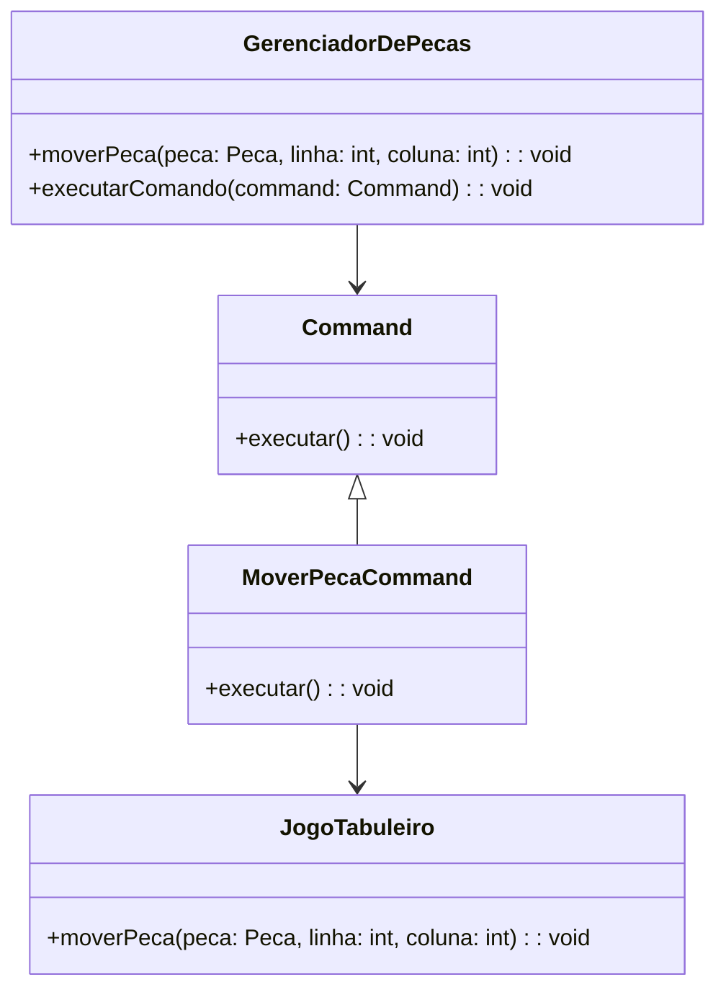
### Participantes no Framework
- **Comando (Command):** Interface que define o método `executar()`, que representa a ação a ser realizada.
- **Comando Concreto (MoverPecaCommand):** Implementa o comando específico para mover uma peça no tabuleiro. Este comando encapsula a lógica de movimento da peça, delegando a ação ao Receiver.
- **Invoker (GerenciadorDePecas):** Classe responsável por receber e invocar comandos, permitindo que as ações de movimento das peças sejam realizadas. Ela instancia o comando e o executa.
- **Receiver (JogoTabuleiro):** Classe que contém a lógica real para a execução das ações do comando, incluindo o método que efetivamente move a peça no tabuleiro.

## Código do Framework
@import "src/framework/Command.java";
@import "src/framework/MoverPecaCommand.java";
@import "src/framework/GerenciadorDePecas.java";

# Padrão de Projeto: State
Função: o jogo pode fica em 2 estados emjogo ou pausado
## Estrutura

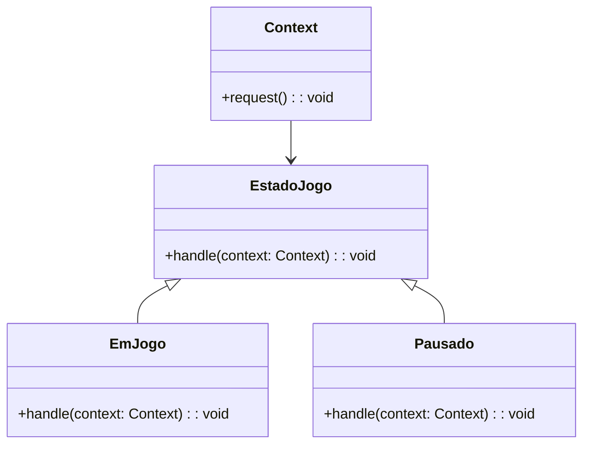
## Participantes no Framework
- **Contexto (JogoTabuleiro):** Contém uma referência a um objeto State e delega a ele as operações que alteram seu estado.
- **Estado (EstadoJogo):** Interface que define um método para as operações do jogo.
- **Estados Concretos (EmJogo, Pausado):** Implementam comportamentos específicos do jogo, como o estado inicial e o estado durante o jogo.

## Código do Framework
@import "src/framework/JogoTabuleiro.java";
@import "src/framework/EstadoJogo.java";
@import "src/framework/EmJogo.java";
@import "src/framework/Pausado.java";

# Exemplo Main JogoSelva
@import "src/Main.java";

## Interação entre Strategy e Command

O padrão **Command** é utilizado para abstrair a ação de mover uma peça em termos gerais. A ação de mover é encapsulada no `MoverPecaCommand`, que utiliza a estratégia configurada para a peça para mover de acordo com as regras de movimento específicas.

O padrão **Strategy** está sendo aplicado às peças através da associação de uma estratégia de movimento a cada peça. No momento em que o comando de movimento é executado (`pecaProxy.mover(linha, coluna)`), a peça usa a estratégia configurada para determinar como ela vai se mover.

Portanto, os dois padrões de projeto trabalham em conjunto no código. O Command define quando e onde a peça será movida, enquanto o Strategy define como ela se moverá, de acordo com a estratégia associada a cada peça.

